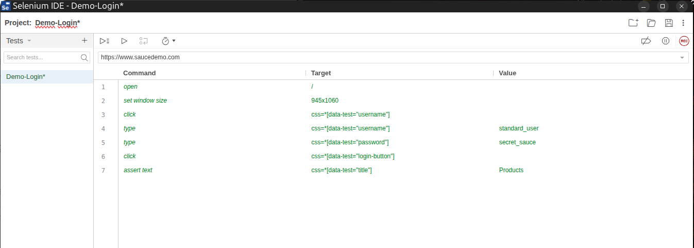

# Pruebas Selenium  

Este repositorio se va a usar para realizar pruebas con Selenium. Empezaremos con Selenium IDE para ver la parte gráfica del mismo e iremos pasando poco a poco a Selenium WebDriver, qué es donde vamos a trabajar.  

## 1. Login de prueba

Cómo hemos explicado anteriormente, vamos a usar Selenim IDE para realizar una prueba visual de su funcionamiento y cómo es que funciona. Para ello lo primero que necesitamos es tener instalada la extensión en nuestro navegador. Una vez hecho esto vamos a entrar en la extensión y pulsaremos en **Record a new test in a new project**, le pondremos un nombre y procederemos a grabar las acciones haciendo clics en la página y escribiendo con el teclado. Después de esto Selenium lo reproducirá automaticamente. Vamos a mostrar los comandos que realiza Selenium IDE para realizar estas acciones:  

*(Comandos de Selenium IDE)*

  

Hemos añadido manualmente el comando **assert text** que lee el texto en el elemento indicado y valida si es correcto. Para terminar guardaremos el test en el archivo **Demo-login.side**.

