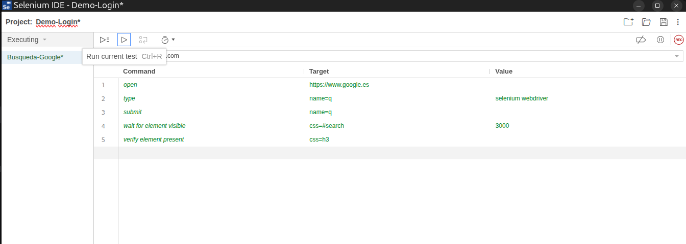

# Pruebas Selenium  

Este repositorio se va a usar para realizar pruebas con Selenium. Empezaremos con Selenium IDE para ver la parte gráfica del mismo e iremos pasando poco a poco a Selenium WebDriver, qué es donde vamos a trabajar.  

## 1. Login de prueba

Cómo hemos explicado anteriormente, vamos a usar Selenim IDE para realizar una prueba visual de su funcionamiento y cómo es que funciona. Para ello lo primero que necesitamos es tener instalada la extensión en nuestro navegador. Una vez hecho esto vamos a entrar en la extensión y pulsaremos en **Record a new test in a new project**, le pondremos un nombre y procederemos a grabar las acciones haciendo clics en la página y escribiendo con el teclado. En esta prueba tenemos que logearnos usando un usuario y contraseñas que nos vienen dadas en la misma página de pruebas y pulsar en el botón Login. Haremos estas acciones nosotros y después de esto Selenium lo reproducirá automaticamente. Vamos a mostrar los comandos que realiza Selenium IDE para realizar estas acciones:  


<div align="center">

*(Comandos de Demo-Login)*
</div>  

Hemos añadido manualmente el comando **assert text** que lee el texto en el elemento indicado y valida si es correcto. Para terminar guardaremos el test en el archivo **Demo-login.side**.

## 2. Suites IDE  

En esta parte vamos a usar la suite que hemos creado en el ejercicio anterior y vamos a ampliarla incluyendo una prueba de Google. Ahora al abrir la extensión usaremos la opción **Open an existing project** y seleccionaremos nuestro Demo-login.side. Ahora nos tocará crear un nuevo test pulsando el botón **Add new test**. Le pondremos el nombre de Busqueda-Google pero en este caso vamos a crear directamente los comandos de Selenium IDE:  

```
|open | Target: https://www.google.com/?hl=es |        
|type | Target: name=q | Value: selenium webdriver|
|submit| Target: name=q |   
|wait for element visible | Target: css=#search| Value: 3000|    
|verify element present | Target: css=h3|
```

<div align="center">  

*(Comandos de Busqueda-Google)*  

Con esto listo el siguiente paso es ejecutar los dos test simultaneos y comprobar que todo funciona perfectamente. En mi caso he tenido que modifficar la velocidad de ejecución para que espere lo suficiente para buscar el elemento **css=#search**. Si no hacía esto Selenium iba tan rápido que no esperaba a que apareciera en pantalla antes de dar error.